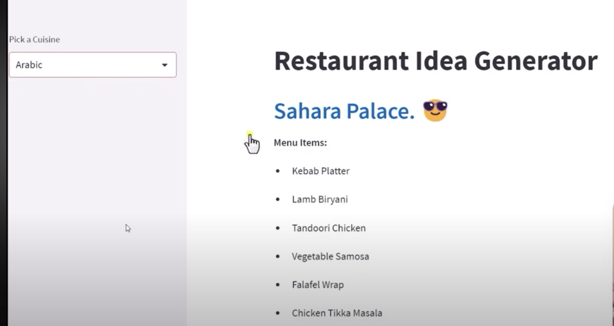

# Restaurant Idea Generator 
A beginner-friendly LLM-based app that suggests restaurant names and menu items based on input cuisine. Built with LangChain and OpenAI to explore prompt templates, chains, and app deployment while learning core LLM concepts.

# 🍽️ Restaurant Idea Generator (LangChain + OpenAI)

> 🚀 Perfect for learning LangChain step-by-step by building a fun and useful project.

---

## 📌 Project Objective

To explore and understand the **LangChain framework** and **OpenAI’s large language models (LLMs)** through hands-on experience by:

- Chaining prompts with `LLMChain`
- Exploring prompt templates
- Adding memory and tools
- Integrating APIs and deployment workflows

---

## 💡 What It Does

1. Takes user input for a **cuisine type** (e.g., Italian, Arabic, Fusion)
2. Uses an **OpenAI LLM** via LangChain to:
   - Suggest a **restaurant name**
   - Generate a list of themed **menu items**
3. Displays the results via a **clean frontend interface** (Streamlit or Gradio)

> Example Output:
> **Cuisine:** Arabic  
> **Restaurant Name:** *Sahara Palace 😎*  
> **Menu:** Kebab Platter, Lamb Biryani, Falafel Wrap, etc.

---

## 🧠 What I'm Learning

- LangChain building blocks:
  - `LLMChain`, `PromptTemplate`, `Agents`, `Tools`, `Memory`
- Prompt engineering and optimization
- Handling API keys securely
- Clean Python code structuring
- Deployment of LLM apps on the web (via Streamlit/FastAPI)
- RAG (Retrieval-Augmented Generation) with Vector Databases 

---

## ⚙️ Tech Stack

- 🧠 **LangChain** – Framework for building LLM-driven apps
- 🤖 **OpenAI API** – GPT-3.5/4 for text generation
- 🐍 **Python**
- 🌐 **Streamlit / Gradio** (UI Layer)
- 📦 (Planned) **FAISS / Pinecone** for vector search
- 🚀 (Planned) **Deployment**: Render, Hugging Face, or Cloud VM

---

## 🧭 Future Enhancements

- Add **LangChain Memory** for persistent interactions
- Enable **vector database integration** for RAG
- Add **tool-using agents** for enhanced flexibility
- Deploy with UI and integrate CI/CD workflows
- Fine-tune prompts for better generation

---

## 🧩 Key Concepts

- **LLMChain**: Chain of prompt + LLM for single outputs
- **PromptTemplate**: Parameterized prompt structure
- **Embedding + Vector DBs**: For private data search and context injection
- **RAG (Retrieval-Augmented Generation)**: Pull context from vector stores
- **Custom LLM Use**: Enterprises train LLMs on their own data for control, privacy & cost

---

## 🧠 Industry Insight

Today, many organizations are building their own internal LLMs trained on **proprietary knowledge** using models like **LLaMA, GPT-J, or Mistral**. Combined with **vector databases** and **embedding techniques**, this allows:

- Secure and private LLM usage
- Business-specific customization
- Reduced API costs
- Real-time internal search

---

## 📸 UI Preview

> Sample Output for Arabic Cuisine  
> 

---

## License

This repository is licensed under the [Creative Commons Attribution-NonCommercial-NoDerivatives 4.0 International License (CC BY-NC-ND 4.0)](https://creativecommons.org/licenses/by-nc-nd/4.0/).

You are free to share and use this content for **non-commercial educational purposes only**. 

No modifications or derivative works are allowed.

